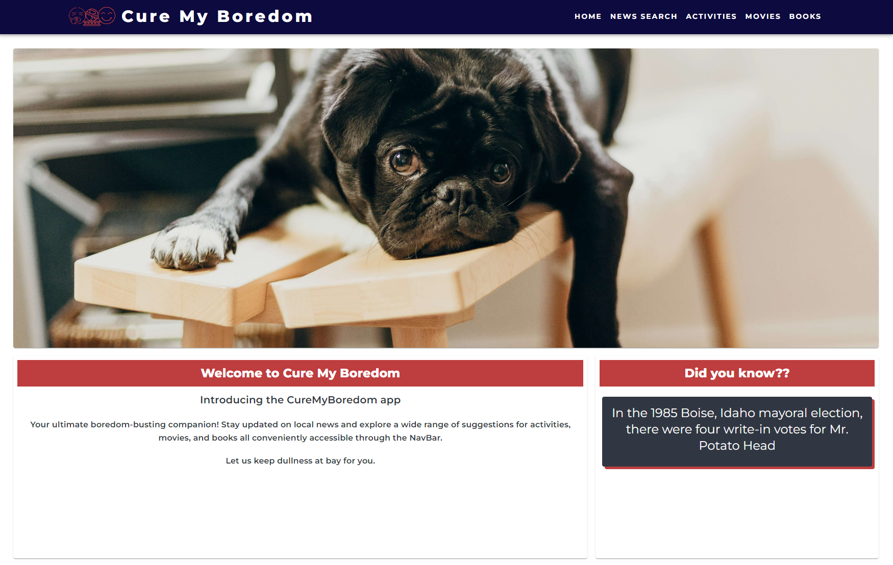
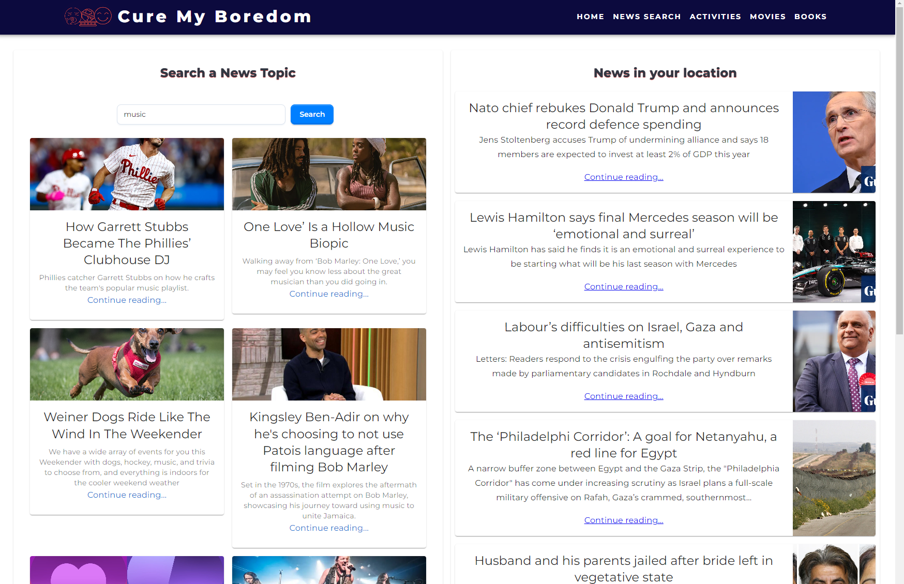
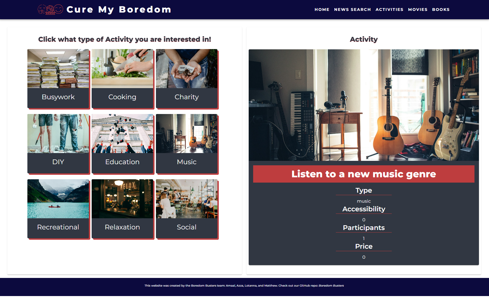
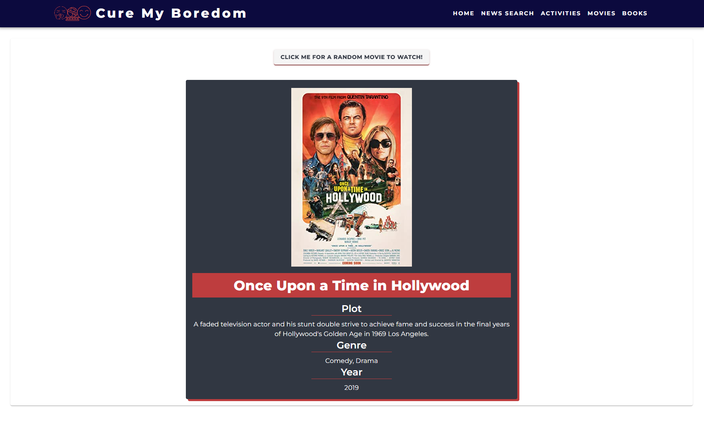
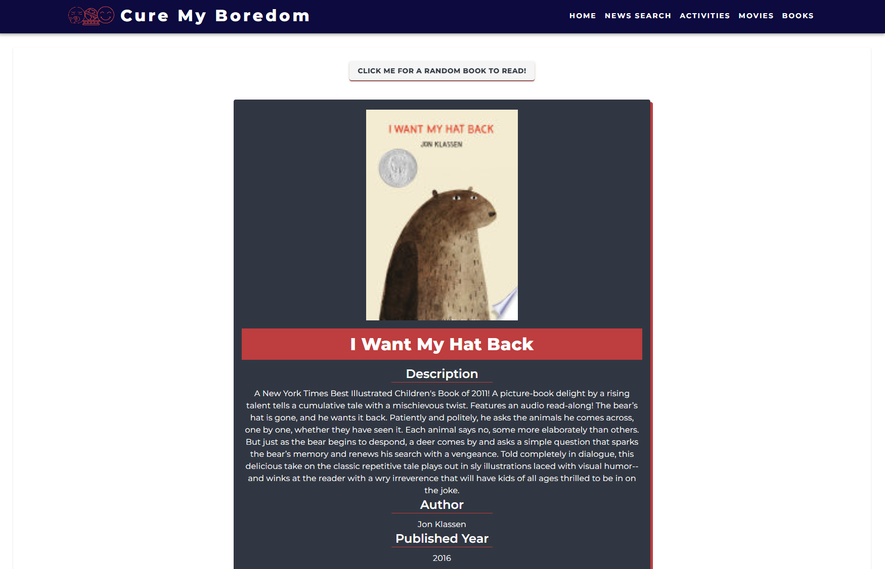

# Cure My Boredom

Welcome Cure My Boredom - your go-to destination for staying informed, entertained, and inspired! This app seamlessly combines local news updates, effortless article searches, a variety of boredom-busting activities, and the excitement of discovering random movies and books, all within a user-friendly interface.

# Usage
Navigation: Navigate through the app sections listed on the homepage: Local News, News Search, Activities, Movies, and Books.
Local News: View curated news articles relevant to your location, complete with summaries and thumbnails.

News Search: Enter keywords or phrases to find specific articles matching your interests.

Activities: Explore various activities to beat boredom, categorized for easy browsing.

Movies: Click the button to discover a random movie suggestion, including title, genre, and synopsis.

Books: Click the button to get a random book recommendation, including title, author, and blurb.

# Installation
Clone the repository.

Navigate to the project directory.

Run npm install to install dependencies.

Run npm dev to start the development server.

# Credits 
A huge gratitude goes out to the bootcamp team for their unwavering support throughout the project, equipping us with the necessary tools for success thus far. The API providers, documentation, and bootstrap have played a significant role in carrying much of the workload for this project.

# Contributors

Amaal Abdule

Azza Abdelrahman

Matthew Lightfoot

Lotanna Amboi

# Screenshot and Links 

# License
This project is licensed under the MIT License - see the LICENSE file for details.

# React + Vite

This template provides a minimal setup to get React working in Vite with HMR and some ESLint rules.

Currently, two official plugins are available:

- [@vitejs/plugin-react](https://github.com/vitejs/vite-plugin-react/blob/main/packages/plugin-react/README.md) uses [Babel](https://babeljs.io/) for Fast Refresh
- [@vitejs/plugin-react-swc](https://github.com/vitejs/vite-plugin-react-swc) uses [SWC](https://swc.rs/) for Fast Refresh
